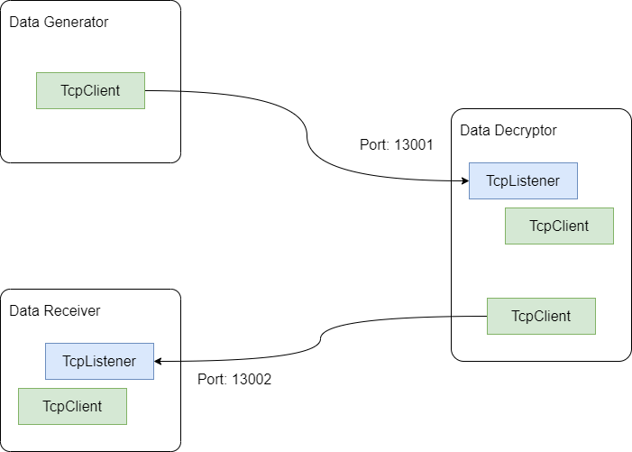

# Caesar’s Cipher

## The Setup

Let's have the following three applications:

- **Data Generator**
  - Sends encrypted text over a TCP connection.
  - The algorithm used for encryption is Caesar's Cipher.
- **Data Decryptor**
  - Receives the encrypted text, decrypts it and sends it further, over TCP, to the Data Receiver.
- **Data Receiver**
  - Displays the text received over the TCP connection.

## Requirement

Your job is to create the Data Decryptor application. The middle one.

The other two applications (Data Generator and Data Receiver) are already implemented. They will be provided to you.

The address and port on which to listen for incoming requests and the address and port where to send the decrypted text must be configurable in the configuration file.

## Encryption Algorithm (Caesar's Cipher)

The encryption is performed using the Caesar's Cipher, with a right shift of 1.

- a --> b

- b --> c

- ...
- y --> z
- z --> a

The letter's case is preserved:

- If letter was lower case before encryption, it will be a lower case letter after decryption.
- If letter was upper case before encryption, it will be a upper case letter after decryption.

Only letters are encrypted/decrypted. Other characters are left untouched.

More details about the algorithm can be found on Wikipedia:

- https://en.wikipedia.org/wiki/Caesar_cipher

## Hints

.NET has a `Socket` class to deal with socket communication. It can handle multiple protocols: UDP, TCP, etc.

In our exercise we use TCP/IP. To easily interact with this protocol, .NET provides two classes: `TcpClient` and `TcpListener`. Internally, they use `Socket` instances.