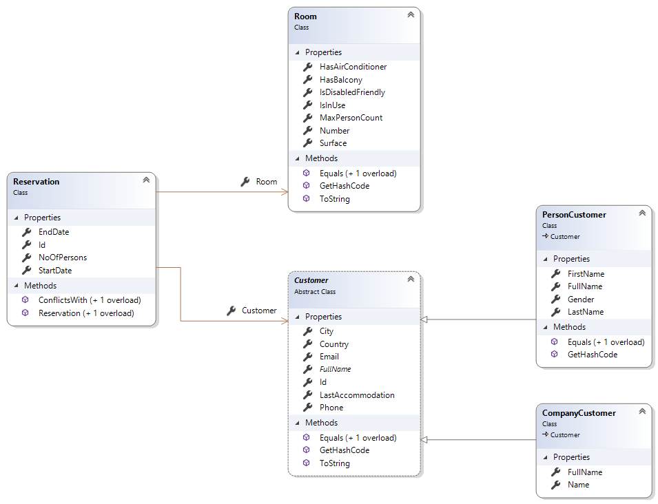

# Hotel Queries

## Overview

Let’s imagine a collection of data used by a Hotel application.

In a hotel we have:

- rooms
- customers
  - To be more interesting we will choose two types of customers: persons and companies.
- reservations

## Class Diagram

## Visual Studio Solution

There are 4 projects in the solution, but the important ones are:
- `HotelQueries`
  - Contains a `Hotel` class that performs several queries over these data. Well… actually, the methods are not implemented yet.
- `HotelQueries.Tests`
  - Contains a collection of tests that verify if the queries are correctly implemented.

## Requirement

Your task is to implement the methods from the `Hotel` class to actually return the requested data. See the comments above each method for details regarding the data that should be returned.