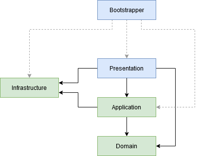

# The Universe

## Application Overview

"The Universe" is a console application that creates a universe containing galaxies and stars.

There are three commands that the user can use:

- **add-galaxy** - Adds a new galaxy to the universe.

- **add-star** - Adds a new star to an existing galaxy.

- **display-stars** - Shows all the stars existing in the current universe.

## The Problem

The application was implemented a long time ago, in the age when C# did not have generics.

Today, we looked at the code and discovered that some unnecessary boxing/unboxing occur when the `RequestBus` is used:

-  The `Send` method has a parameter of type object as request and returns an object as response.

-  The request handlers also use the object type for the request and response instances.

We need you to improve the implementation by using generics and update the usage of the `RequestBus` in the application.

## Application Internals

### Commands

Each command from the user is translated by the presentation layer into a request and sent to the business layer.

Between these two layers there is a middleman that intermediates the communication. This middleman is called the `RequesBus`. (see the Infrastructure project)

### Request Bus

The `RequestBus` keeps internally a list of request/request-handler pairs.

When the `RequestBus` receives a request, it searches for the appropriate request handler to execute.

### List of Projects

The Visual Studio solution contains the following projects:

- **Domain** (Business) – It contains the domain entities (`Universe`, `Galaxy`).

- **Application** (Business) – It contains the use case implementations: the requests and the associated request handlers.

- **Infrastructure** – It contains the implementation of the `RequestBus`.

- **Presentation** – It contains the loop that reads commands from the Console, executes the use cases, and displays the results.

- **main project** – It contains the application's setup (`Bootstrapper`).

The architecture diagram:

  

## Hints

Even if this application is quite big and has allot of code, do not panic, you are not required to understand it all.

Your work must be focused on improving the `RequestBus` implementation. Start from the `RequestBus.Send()` method and investigate where is it used.

It is expected you will need to work in the following projects:

- **Infrastructure** - The `RequestBus` class is there.

- **Application** - Update the request classes and the associated handlers to use generics.

- **Presentation** (command classes) - Update the calls to those requests.